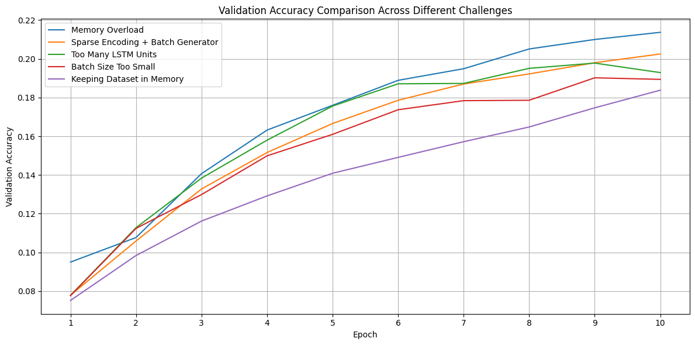

# Egyptian Hieroglyphic Language Model

An experimental Natural Language Processing (NLP) project exploring language modeling techniques for Ancient Egyptian hieroglyphic text.

The goal of this project was to investigate whether modern deep learning techniques could learn patterns from a cleaned hieroglyphic corpus derived from **Alan Gardiner's List of Hieroglyphic Signs** and generate meaningful next-word predictions.

Although the project did not evolve into a complete translation system, it became an exploration of sequence modeling, memory optimization, and language generation using TensorFlow and LSTM networks.

---

## Project Goal

The original objective was to build the foundation for an Ancient Egyptian hieroglyphic translation system.

Because hieroglyphic writing differs significantly from modern spoken languages and has limited publicly available NLP datasets, this project instead focused on learning statistical language patterns from a cleaned corpus before attempting translation.

---

## Dataset

The training corpus was created from:

**Alan Gardiner's List of Hieroglyphic Signs**

The original material was cleaned and converted into a text dataset suitable for neural network training.

The processed dataset is stored as:

```
dataset_final.txt
```

---

## Project Versions

<h2 align="center">Validation Accuracy Comparison</h2>

<p align="center">
  
</p>

### Version 1

Initial LSTM language model.

Features:

- Text preprocessing
- Tokenization
- Sliding window sequence generation
- Memory-efficient file loading
- Batch generator
- Sparse categorical cross entropy
- Next-word prediction

Architecture:

```
Embedding
↓
LSTM (64)
↓
LSTM (32)
↓
Dense (128)
↓
Softmax
```

Final Validation Accuracy

```
18.38%
```

---

### Version 2

A second experiment introducing regularization techniques.

Changes included:

- Dropout layers
- L2 Regularization
- ReduceLROnPlateau learning rate scheduling

Architecture:

```
Embedding
↓
LSTM (64)
↓
Dropout
↓
LSTM (32)
↓
Dropout
↓
Dense
↓
Softmax
```

Final Validation Accuracy

```
11.22%
```

Although intended to improve generalization, these additions reduced performance on this dataset compared to Version 1.

---

## Training Results

| Version | Validation Accuracy |
|----------|-------------------:|
| Version 1 | 18.38% |
| Version 2 | 11.22% |

Version 1 produced the strongest overall performance.

---

## Text Generation

After training, the model predicts the next word iteratively.

Example:

Input

```
the great pharaoh
```

Generated Output

```
the great pharaoh recitation recitation is the one of the one of the
```

This demonstrates that the model successfully learned local language patterns from the training corpus, although it still struggled with semantic coherence due to the limited size and specialized nature of the dataset.

---

## Memory Optimization

Several experiments were performed to improve training efficiency.

These included:

- Streaming dataset loading
- Batch generators
- Sparse encoding
- Reduced memory footprint
- Dataset size limiting
- Garbage collection during preprocessing

A comparison of different optimization strategies is included in the repository.

---

## Technologies

- Python
- TensorFlow
- Keras
- NumPy
- Scikit-learn
- Matplotlib

---

## Repository Structure

```
dataset_final.txt
train_v1.py
train_v2.py
predict.py
tokenizer.pkl
egyptian_text_model.keras
results/
README.md
```

---

## Future Work

Possible future improvements include:

- Transformer-based language models
- Larger hieroglyphic corpora
- English ↔ Hieroglyphic translation
- Attention mechanisms
- Better evaluation metrics
- Collaboration with Egyptology resources

---

## Disclaimer

This repository is an experimental academic project developed to explore NLP techniques on Ancient Egyptian hieroglyphic text.

It should not be considered a production-ready translation system or an authoritative linguistic resource.
